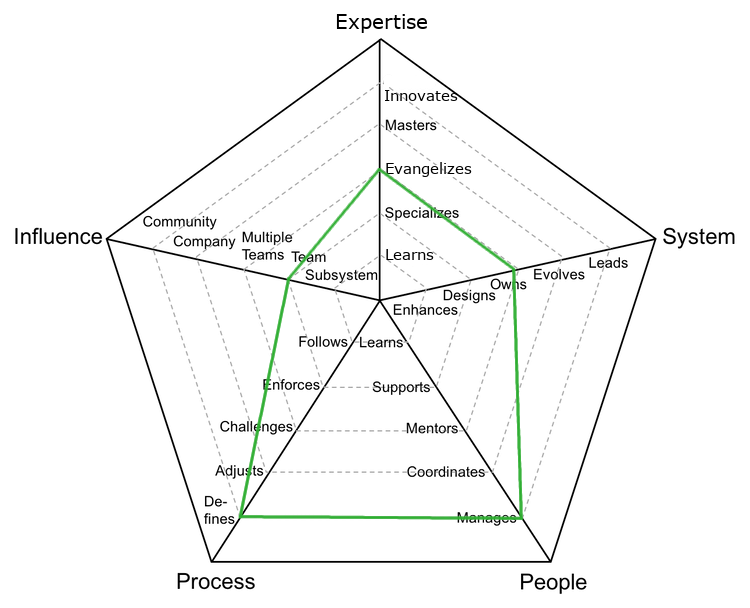

# Engineering Manager

Role also known as dev manager, is responsible for the consistent delivery, career growth and level of happiness of the team.

| Level | Senior |                          Position                           |
| :---: | :----: | :---------------------------------------------------------: |
|   4   |  Yes   | [EM4 - Engineering Manager 4](#em4---engineering-manager-4) |
|   5   |  Yes   | [EM5 - Engineering Manager 5](#em5---engineering-manager-5) |
|   6   |  Yes   | [EM6 - Engineering Manager 6](#em6---engineering-manager-6) |

If you have other managers as direct reports, you might want to read the [Managing Managers](Managing-Managers.md) section since it provides more information about the "Manages People" aspect of the role.

## EM4 - Engineering Manager 4

<picture>
  <!-- <source media="(prefers-color-scheme: dark)" srcset="charts/engineeringmanager-4-dark.png">
  <source media="(prefers-color-scheme: light)" srcset="charts/engineeringmanager-4.png"> -->
  
</picture>

- **Expertise: Evangelizes**: researches, creates proofs of concept and introduces new technologies to the team
- **System: Owns**: owns the production operation and monitoring of the system and is aware of its SLAs
- **People: Manages**: manages the team members' career, expectations, performance and level of happiness
- **Process: Defines**: defines the right processes for the group's maturity level, balancing agility and discipline
- **Influence: Team**: makes an impact on the whole team, not just on specific parts of it

## EM5 - Engineering Manager 5

<picture>
  <!-- <source media="(prefers-color-scheme: dark)" srcset="charts/engineeringmanager-5-dark.png">
  <source media="(prefers-color-scheme: light)" srcset="charts/engineeringmanager-5.png"> -->
  
</picture>

- **Expertise: Evangelizes**: researches, creates proofs of concept and introduces new technologies to the team
- **System: Evolves**: evolves the architecture to support future requirements and defines its SLAs
- **People: Manages**: manages the team members' career, expectations, performance and level of happiness
- **Process: Defines**: defines the right processes for the group's maturity level, balancing agility and discipline
- **Influence: Multiple Team**: makes an impact not only on the whole team but also on other teams

## EM6 - Engineering Manager 6

<picture>
  <!-- <source media="(prefers-color-scheme: dark)" srcset="charts/engineeringmanager-6-dark.png">
  <source media="(prefers-color-scheme: light)" srcset="charts/engineeringmanager-6.png"> -->
  
</picture>

- **Expertise: Evangelizes**: researches, creates proofs of concept and introduces new technologies to the team
- **System: Evolves**: evolves the architecture to support future requirements and defines its SLAs
- **People: Manages**: manages the team members' career, expectations, performance and level of happiness
- **Process: Defines**: defines the right processes for the team's maturity level, balancing agility and discipline
- **Influence: Company**: makes an impact on the whole tech organization

# Other Pages

- [**Introduction**](README.md)
- [**Developer**](Developer.md)
- [**Product Designer**](ProductDesigner.md)
- [**Product Manager**](ProductManager.md)
- [**Managing Managers**](Managing-Managers.md)
