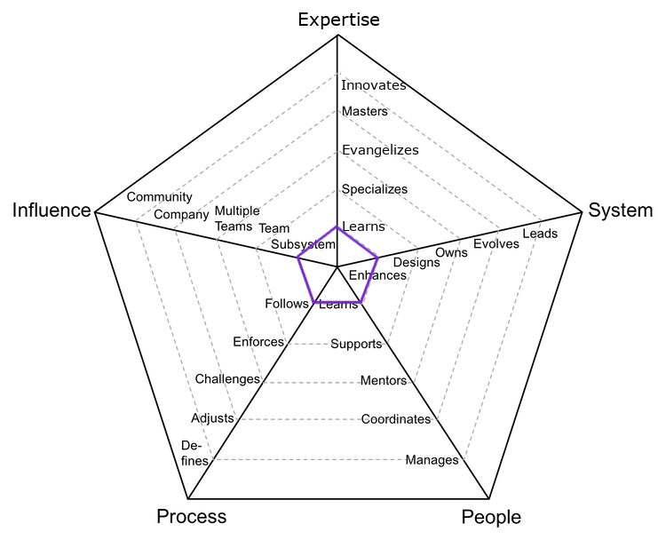
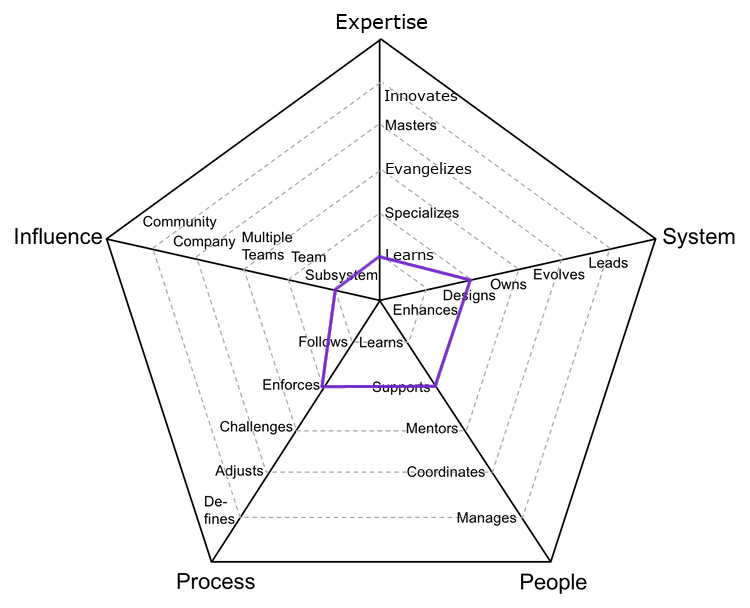
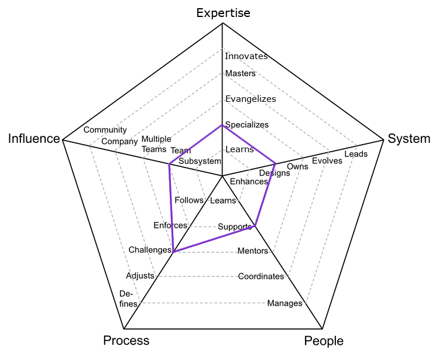
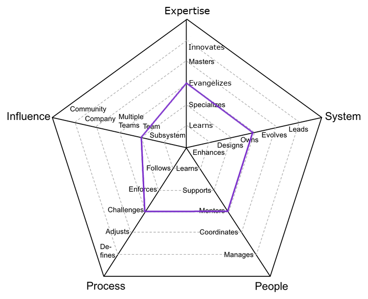
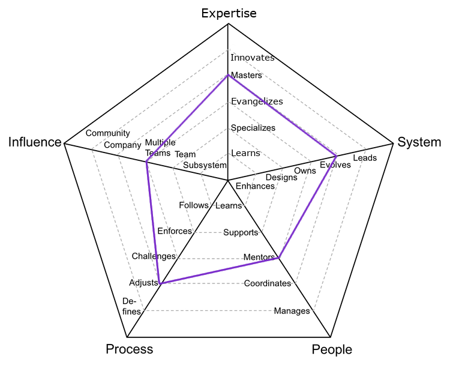

# Product Designer

Role also known as programmer or software engineer, requires a deep level of technical expertise.

| Level | Senior |                       Position                        |
| :---: | :----: | :---------------------------------------------------: |
|   1   |   No   | [PD1 - Product Designer 1](#pd1---product-designer-1) |
|   2   |   No   | [PD2 - Product Designer 2](#pd2---product-designer-2) |
|   3   |   No   | [PD3 - Product Designer 3](#pd3---product-designer-3) |
|   4   |  Yes   | [PD4 - Product Designer 4](#pd4---product-designer-4) |
|   5   |  Yes   | [PD5 - Product Designer 5](#pd5---product-designer-5) |
|   6   |  Yes   | [DP6 - Product Designer 6](#pd6---product-designer-6) |

## PD1 - Product Designer 1

<picture>
  <source media="(prefers-color-scheme: dark)" srcset="charts/designer-1-dark.png">
  <source media="(prefers-color-scheme: light)" srcset="charts/designer-1.png">
  
</picture>

- **Expertise: Learns**: actively learns and adopts the design system and tools defined by the team
- **System: Enhances**: successfully pushes new design components to improve and extend the system
- **People: Learns**: quickly learns from others and consistently steps up when it is required
- **Process: Follows**: follows the team processes, delivering a consistent flow of features to production
- **Influence: Subsystem**: makes an impact on one or more subsystems or team pods

## PD2 - Product Designer 2

<picture>
  <source media="(prefers-color-scheme: dark)" srcset="charts/designer-2-dark.png">
  <source media="(prefers-color-scheme: light)" srcset="charts/designer-2.png">
  
</picture>

- **Expertise: Learns**: actively learns and adopts the technology and tools defined by the team
- **System: Designs**: designs and implements medium to large size features while reducing the system's tech debt
- **People: Supports**: proactively supports other team members and helps them to be successful
- **Process: Enforces**: enforces the team processes, making sure everybody understands the benefits and tradeoffs
- **Influence: Subsystem**: makes an impact on one or more subsystems or team pods

## PD3 - Product Designer 3

<picture>
  <source media="(prefers-color-scheme: dark)" srcset="charts/designer-3-dark.png">
  <source media="(prefers-color-scheme: light)" srcset="charts/designer-3.png">
  
</picture>

- **Expertise: Specializes**: is the go-to person for one or more user journey and takes initiative to learn new ones
- **System: Designs**: designs and implements medium to large size features while reducing the system's tech debt
- **People: Supports**: proactively supports other team members and helps them to be successful
- **Process: Challenges**: challenges the team processes, looking for ways to improve them
- **Influence: Team**: makes an impact on the whole team, not just on specific parts of it

## PD4 - Product Designer 4

<picture>
  <source media="(prefers-color-scheme: dark)" srcset="charts/designer-4-dark.png">
  <source media="(prefers-color-scheme: light)" srcset="charts/designer-4.png">
  
</picture>

- **Expertise: Evangelizes**: researches, creates proofs of concept and introduces new design techniques to the team
- **System: Owns**: owns the production operation and monitoring of the design system and is aware of its SLAs
- **People: Mentors**: mentors others to accelerate their career-growth and encourages them to participate
- **Process: Challenges**: challenges the team processes, looking for ways to improve them
- **Influence: Team**: makes an impact on the whole team, not just on specific parts of it

## PD5 - Product Designer 5

<picture>
  <source media="(prefers-color-scheme: dark)" srcset="charts/designer-5-dark.png">
  <source media="(prefers-color-scheme: light)" srcset="charts/designer-5.png">
  
</picture>

- **Expertise: Masters**: has very deep knowledge about the whole design system and UX craft
- **System: Evolves**: evolves the design system to support future requirements and defines its SLAs
- **People: Mentors**: mentors others to accelerate their career-growth and encourages them to participate
- **Process: Adjusts**: adjusts the team processes, listening to feedback and guiding the team through the changes
- **Influence: Multiple Teams**: makes an impact not only on the whole team but also on other teams

## PD6 - Product Designer 6

<picture>
  <source media="(prefers-color-scheme: dark)" srcset="charts/designer-6-dark.png">
  <source media="(prefers-color-scheme: light)" srcset="charts/designer-6.png">
  
</picture>

- **Expertise: Masters**: has very deep knowledge about the whole design system and UX craft
- **System: Leads**: leads the technical excellence of the design system and creates plans for major overhauls
- **People: Mentors**: mentors others to accelerate their career-growth and encourages them to participate
- **Process: Adjusts**: adjusts the team processes, listening to feedback and guiding the team through the changes
- **Influence: Company**: makes an impact on the whole tech organization

# Other Pages

- [**Introduction**](README.md)
- [**Product Designer**](ProductDesigner.md)
- [**Product Manager**](ProductManager.md)
- [**Engineering Manager**](EngineeringManager.md)
- [**Managing Managers**](Managing-Managers.md)
